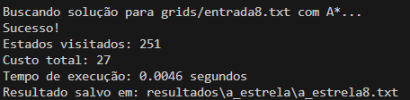
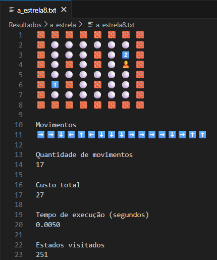
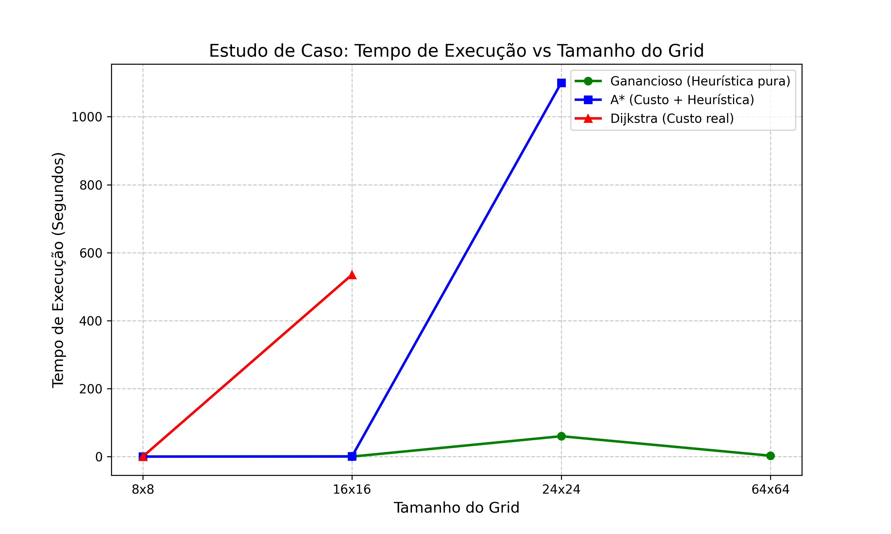
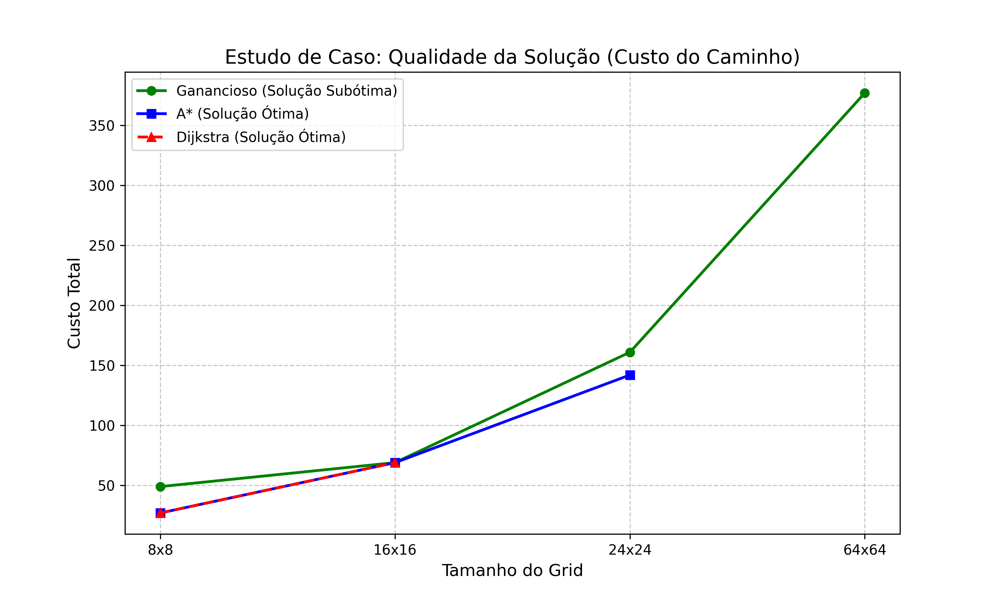

# Projeto de Busca: Agente e Caixas (Sokoban Ponderado)
O projeto implementa algoritmos de busca para resolver um quebra-cabeça onde um agente deve empurrar caixas numeradas até áreas específicas. O diferencial deste modelo é que cada caixa possui um "peso" que influencia o custo do movimento.

## Como rodar os algoritmos e funcionamento
Na pasta do repositório clonado, você vai escolher o algoritmo e a grid desejada segundo o seguinte formato:

`python -m algoritmos.{algoritmo} grids/entrada{tamanho}.txt` 

Exemplo:
* `python -m algoritmos.a_estrela grids/entrada16.txt`
* `python -m algoritmos.dijkstra grids/entrada8.txt`
* `python -m algoritmos.ganancioso grids/entrada64.txt`

Depois de rodar o algoritmo desejado na grid desejada, depois de um tempo (que varia conforme algoritmo e grid), ele vai mostrar uma mensagem no terminal

*Alguns algoritmos não desempenham bem conforme o tamanho da grid, uma relação com tempo observado e desempenho está no final do README, na aba de Estudo de Caso*

E o resultado será salvo dentro da pasta de Resultados, na subpasta do respectivo algoritmo

## Modelagem

### 1. Função Sucessora (`gerar_sucessores`)

A função sucessora é responsável por determinar quais estados podem ser alcançados a partir do estado atual.

* **Mecânica:** O algoritmo localiza o agente (`🙎`) e testa movimentos para as quatro direções cardinais.
* **Movimento Simples:** O agente se move para uma célula vizinha se ela for um espaço vazio (`⚪️`) ou um alvo (`🟢`).
* **Movimento de Empurrar:** Se o agente encontrar uma caixa (`1️⃣`, `2️⃣`, etc.), o algoritmo verifica a célula seguinte na mesma direção. Se estiver livre, o agente "empurra" a caixa, resultando em um novo estado onde tanto o agente quanto a caixa mudaram de posição.
* **Bloqueios:** Paredes (`🧱`) e o limite do mapa impedem a geração de sucessores naquela direção.

### 2. Função Objetivo (`testar_objetivo`)

A função objetivo define quando o problema foi resolvido.

* Ela armazena os índices originais de todos os alvos (`🟢`) no início da execução.
* A cada novo estado, ela verifica se **todos** esses índices agora contêm uma caixa (qualquer valor numérico).
* O objetivo é satisfeito apenas quando não resta nenhum alvo vazio.

### 3. Calcular Custo (`calcular_passo`)

Diferente de buscas uniformes, aqui cada ação possui um custo específico baseado no esforço:

* **Custo Base:** Qualquer movimento do agente tem um custo base de **1**.
* **Custo de Empuxo:** Se o agente empurrar uma caixa, o custo desse passo é somado ao valor numérico daquela caixa.
* **Fórmula:** $Custo = 1 + Valor\_da\_Caixa$.
* *Exemplo:* Empurrar a caixa `8️⃣` custa **9**, enquanto empurrar a caixa `1️⃣` custa **2**.

### 4. Função Heurística (`heuristica`)

A heurística estima a distância que falta para atingir o objetivo. Utilizamos a **Soma das Distâncias de Manhattan**.

* Para cada caixa no mapa, calculamos a distância entre sua posição atual $(linha_c, coluna_c)$ e a posição do alvo mais próximo $(linha_a, coluna_a)$:

$$h(n) = |linha_c - linha_a| + |coluna_c - coluna_a|$$

* Também multiplicamos a distância estimada por (1 + peso da caixa) para cada passo

* A heurística total é a soma dessas distâncias para todas as caixas. Isso fornece ao algoritmo uma "bússola" de qual estado parece estar mais perto da vitória.

### 5. Representação Interna de Estados

Para garantir eficiência e evitar loops infinitos, o estado é tratado da seguinte forma:

* **Estrutura:** O grid é convertido em uma **lista flat** (unidimensional) de strings. Isso facilita a cópia de estados e a busca de índices.
* **Identificador (ID):** Criamos uma string única para cada estado usando `"".join(estado)`.
* **Memória de Busca:**
* No **Dijkstra**, usamos um dicionário `visitados = {id: custo}` para garantir que só re-exploremos um estado se encontrarmos um caminho mais barato.
* No **Ganancioso**, usamos um `set()` apenas para evitar repetir estados, já que ele não foca no custo acumulado.
* No **A\***, assim como no Dijkstra, utilizamos um dicionário `visitados = {id: custo_g}`. Isso é fundamental porque o A* garante o caminho ótimo; logo, se ele encontrar um estado já visitado, mas por um caminho cujo custo real $g(n)$ seja menor, ele atualiza esse valor e reaproveita a rota mais barata.

### 6. Por que a Heurística é Admissível?

Uma heurística é **admissível** se ela nunca superestima o custo real: $$h(n) \leq h^*(n)$$

* **Prova de Admissibilidade:** A distância de Manhattan assume um mundo perfeito sem paredes, onde as caixas vão direto ao alvo.
* No nosso problema, o custo real sempre será igual ou maior que a distância de Manhattan, pois:
1. A heurística calcula exatamente os passos mínimos de deslocamento da caixa e os multiplica por $(1 + W)$, onde W é o peso da caixa
2. A distância de Manhattan conta apenas os passos, e cada passo no nosso código custa no mínimo 1.
3. Paredes e manobras do agente para se posicionar atrás da caixa adicionam custos extras que a heurística ignora.

* Portanto, $h(n)$ sempre será uma estimativa "otimista", o que garante que, ao usar o A*, encontraremos a solução ótima.

## Estudo de caso
**Todos os dados abaixo estão disponíveis dentro dos .txt da pasta de resultados**

### **Dijkstra**
Tamanho Grid  | Tempo (s)| Estados Visitados | Movimentos | Custo Total 
:--------:|:------:|:------:|:------:|:------:|
| 8x8 | 0,0331 | 3.514| 17 | 27
| 16x16 | 535.2873 | 3.045.566 | 39 | 69
| 24x24 | Timeout (30min) | --- | --- | ---
| 64x64 | Crash/Limite de memória| --- | --- | ---

Analisando a tabela do algoritmo de Dijkstra podemos notar algumas coisas. Em primeiro momento como os estados pulam de 3.514 para mais de três milhões quando a área do grid somente quadruplicou. Isso se deve pela falta de heurística para guiar o algoritmo, fazendo com que todas as direções sejam exploradas e o tempo passe de 0,03 segundos para quase 10 minutos. Podemos observar que a partir do grid 24x24, o algoritmo começa a consumir muita a memória, de forma insustentável para o cálculo. Nos testes realizados tivemos os seguintes resultados:
* 24x24 - Código rodando por cerca de 30 minutos até dar timeout pelo terminal
* 64 x 64 - Crashar a máquina de duas pessoas diferentes do grupo, forçando o reiniciamento por causa do consumo de memória RAM. Um dos computares tem 8GB de RAM e o outro 32GB.

### **Ganancioso**
Tamanho Grid  | Tempo (s)| Estados Visitados | Movimentos | Custo Total
:--------:|:------:|:------:|:------:|:------:|
| 8x8 | 0,0023 | 141| 37 | 49
| 16x16 | 0,0094 | 183 | 39 | 69
| 24x24 | 56,9163 | 544.216 | 102 | 161
| 64x64 | 2,5806 | 3809 | 219 | 377

Analisando a tabela do algoritmo Ganancioso, ou Greedy, podemos perceber como o foco apenas na heurística faça com que ele seja mais rápido que os outros dois e visite menos estados. Porém, por não considerar o caminho real, ele entrega soluções mais caras que os demais algoritmos na maioria dos casos.  
**Comparação de custo**
* **8x8**: 27 (A* e Dijkstra) x 49 (Ganancioso)
* **24x24**: 142 (A*) x 161 (Ganancioso)  

Outra coisa que chamou a atenção no nosso experimento foi a discrepância de tempo e estado entre os grids de 24x24 e 64x64. Isso se deve provavelmente pela disposição da grid, onde uma das caixax está do lado esquerdo com o agente e o objetivo está a direita, com paredes no meio. O algoritmo provavelmente achou um gargalo ao tentar atravessar as paredes, fazendo com que ele visitasse muitos estados e demorasse cerca de um minuto. No grid de 64, não existe paredes que formem barreiras diretamente na linha do objetivo e da caixa, fazendo com que o algoritmo seja executado bem rápido.

### **A***
Tamanho Grid  | Tempo (s)| Estados Visitados | Movimentos | Custo Total
:--------:|:------:|:------:|:------:|:------:|
| 8x8 | 0,0050 | 251 | 17 | 27
| 16x16 | 0,5819 | 13.448 | 39 | 69
| 24x24 | 1099,8640 | 1.074.736 | 83 | 142
| 64x64 | Crash/Limite de memória| --- | --- | ---

Analisando a tabela do algoritmo A* podemos observar que a sua eficiência diminui conforme o tamanho do problema cresce. Ele utiliza a função *f(n) = g(n) + h(n)* onde g(n) é o **custo real** e o **h(n)** é a heurística, assim o algoritmo se direciona pela heurística buscando o menor custo. Nos grids de 8x8 e 16x16, o A* **acha o custo perfeito mais rápido e visitando menos estados do que o algoritmo de Dijkstra**
Porém o A* sofre da mesma complexidade espacial do Dijkstra. Para encontrar o melhor caminho ele precisa manter na memória todos os estados visitados. No grid de 24x24, ele demorou cerca de 18 minutos e avaliou mais de um milhão de estados para achar o melhor caminho. Na maior grid que temos, ele causou um consumo de memória absurdo e um crash, semelhante ao algoritmo de DIjkstra, provando assim que esses algoritmos de busca podem apresentar limitações práticas em ambientes complexos com grandes combinações de estados.

## Gráficos
*Ambos gerados pelo arquivo gerar_graficos.py na subpasta de gráficos, é necessário a instalação do matplotlib pelo pip*
### Tempo de execução vs Tamanho do Grid

Podemos analisar o desempenho de cada algoritmo da seguinte forma:
* **Dijkstra (triângulo vermelho)**: a linha vermelha mostra o perigo da busca sem uma heurística pra guiar. Depois do 16x16, que já tem um grande crescimento de tempo, o algoritmo extrapola os limites de tempo e do consumo de RAM.
* **Ganancioso (circulo verde)**: A linha verde se mantém em um baixo tempo de execução, mostrando que o algoritmo não tem uma requisição de memória e processamento não muito alta. Podemos ver um aumento no grid de 24x24, que é quando o algoritmo enfrentou gargalos para poder contornar as paredes
* **A* (quadrado azul)**:
a linha azul mostra o poder do cálculo de custo junto com a heurística, mantendo um baixo tempo de execução até o grid de 16x16. Podemos observar no gráfico, pelo grande aumento de tempo de execução, que o algoritmo perde eficiência quando tem que mapear centenas de milhares de estados alternativos, tanto que ele "quebra" tentando resolver o grid de 64x64

### Custo do caminho

Podemos observar no gráfico como a linha vermelha (Dijkstra) e azul (A*) estarem perfeitamente sobrepostas nas duas primeiras grids, garantindo o caminho mais barato possível. Isso é uma demonstração de como a heurística do A* nunca superestima o custo, podendo assim ser considerada admissível. 
O crescimento repentino e descolado do algoritmo Ganancioso (verde) mostra o comportamento do algoritmo, classificado como subótimo. Pois ele foca somente na heurística, descartando o custo real, o que penaliza o custo real do caminho.